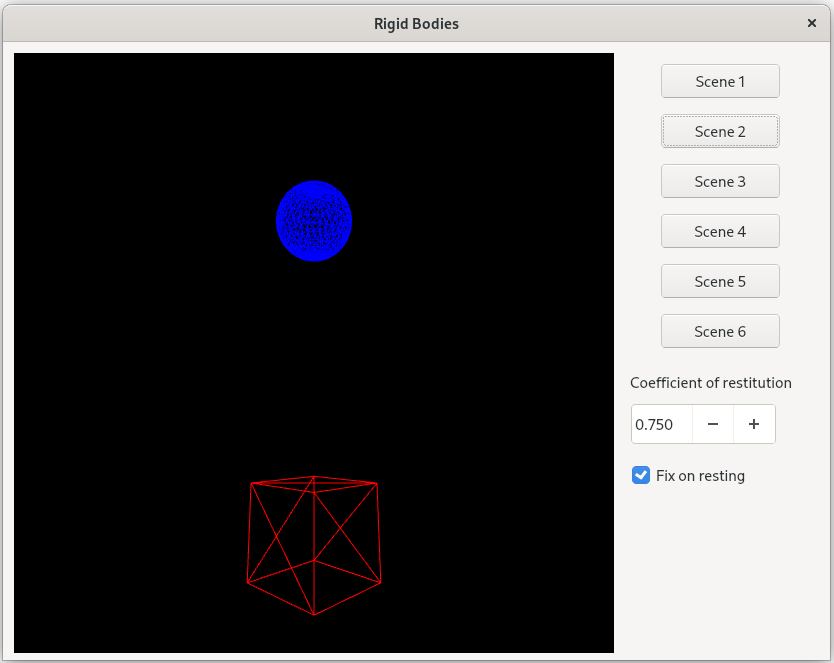
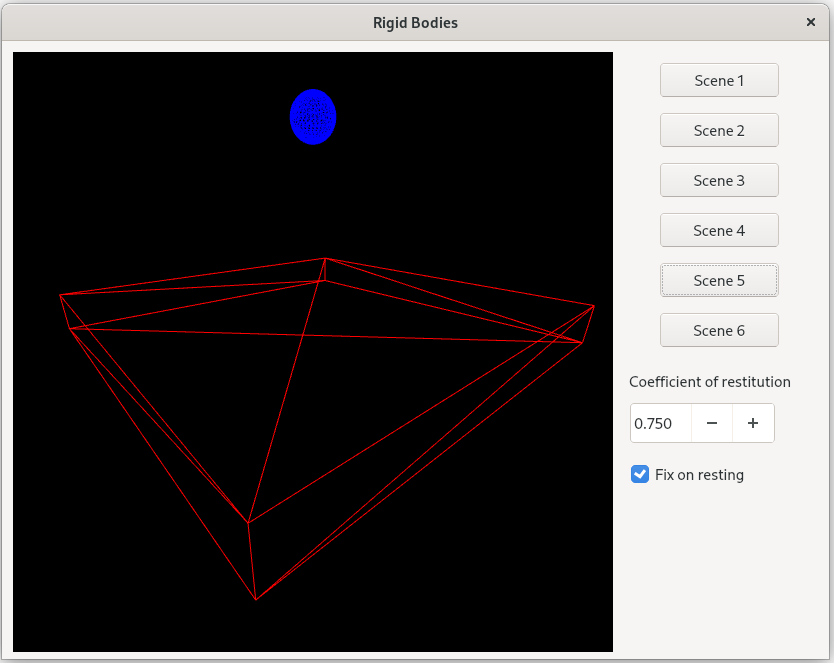

# Rigid Bodies
A very simple CPU driven rigid bodies system with an OpenGL renderer. Qt 5 used as the base framework.

The rigid body system implementation is based on the _Physically Based Modeling SIGGRAPH 2001 Course_ notes.

## Features
- Control the camera (`WASD` keys for movement, and `mouse left click` + `mouse movement` for orientation).
- Semi-implicit Euler as the numerical solver.
- Collider types implemented:
	- Sphere
	- Cube
- Force fields implemented:
	- Gravity
	- Drag

## Known issues
- The resting contact has is not implemented. Instead of applying the resting contact, objects position and rotation get fixed.

## Requirements
The software requires the following libraries to be installed:
- GLEW
- Eigen
- QT 5

## Build
Clone the repository:

	git clone https://github.com/GerardMT/Rigid-Bodies
	cd Rigid-Bodies

Compile the code:

    cd src
    qmake-qt5
    make

The builds can be found at `build/`.

## Run
Once build, run the project from the build directory:

	cd ../build/release/
	./rigid-bodies

## Screenshots
 

## Other
Have a look at my other physics based projects:
- [Particles](https://github.com/GerardMT/Particles)
- [Hair](https://github.com/GerardMT/Hair)
- [Cloth](https://github.com/GerardMT/Cloth)